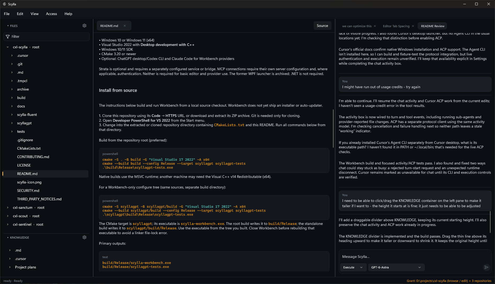

# Scylla



Scylla is an experimental Windows-native coding workspace with AI providers, a source editor, integrated terminals, and explicit controls for project access, knowledge folders, connections, and secrets.

The product in this repository is **Scylla Workbench** (`scylla-workbench.exe`). The former AppContainer CLI (Scylla Cage) is archived under [`archive/scylla-cage/`](archive/scylla-cage/) and is not built.

> [!WARNING]
> This is pre-release software. Review the threat model and lockdown notes, test with non-sensitive data, and verify provider and grant behavior before relying on it. Sandbox and policy controls reduce access; they do not make untrusted software safe.

## Scylla Workbench

Workbench is a native C++20 Win32 application with Scintilla and Lexilla. It runs a locally installed Codex app-server over stdio and invokes Claude Code in print mode. Provider software and account access are obtained separately.

| Area | Available now |
|---|---|
| Projects and agents | Project tree, tabbed editor, syntax highlighting, file/selection context, local conversations, and provider/model selection. |
| Terminal | Integrated ConPTY shells, terminal profiles, multiple sessions, rename/restart/duplicate/close actions, and project environment selection. |
| Knowledge | Additional folders with project scope, agent availability, access settings, folder overrides, and health checks; separate Knowledge and Skills explorer groups. |
| MCP connections | HTTP OAuth, credential storage, connection management, project scope, and HTTP/stdio connection checks. Live tool invocation is deferred. |
| Strata | Optional knowledge-service integration with connection status, recent records, previews, and pending counts. |
| Security | One encrypted app-level Keyring, global/project secret scopes, project environment profiles, and execution policy for protected terminal values. |

Workbench runs as the signed-in Windows user. Project grants, Knowledge access, terminal policy, provider sign-in, MCP authentication, and Keyring unlock are separate controls. Connecting a service does not make all of its capabilities available to the agent. Codex isolation is policy + Job Object + an isolated Codex home — not an OS AppContainer.

## Requirements

- Windows 10 or Windows 11 (x64)
- Visual Studio 2022 with **Desktop development with C++**
- Windows 10/11 SDK
- CMake 3.20 or newer
- Optional: ChatGPT desktop/Codex CLI and Claude Code for Workbench providers

Strata is optional and requires a separately configured service or bridge. MCP connections require their own server configuration and, where applicable, authentication. Neither is required for basic editor and provider use. The former WPF launcher is archived; .NET is not required.

## Install from source

The instructions below build and run Workbench from a local source checkout. Workbench does not yet ship an installer or auto-updater.

1. Clone this repository using its **Code → HTTPS** URL, or download and extract its ZIP archive. Git is needed only for cloning.
2. Open **Developer PowerShell for VS 2022** from the Start menu.
3. Change into the extracted or cloned repository directory containing `CMakeLists.txt` and this README. Run all commands below from that directory.

Build from the repository root (preferred):

```powershell
cmake -S . -B build -G "Visual Studio 17 2022" -A x64
cmake --build build --config Release --target scyllagpt scyllagpt-tests
.\build\Release\scyllagpt-tests.exe
```

Native builds use the MSVC runtime; another machine may need the Visual C++ v14 Redistributable (x64).

For a Workbench-only configure tree (same sources, separate build directory):

```powershell
cmake -S scyllagpt -B scyllagpt/build -G "Visual Studio 17 2022" -A x64
cmake --build scyllagpt/build --config Release --target scyllagpt scyllagpt-tests
.\scyllagpt\build\Release\scyllagpt-tests.exe
```

The CMake target is `scyllagpt`; its executable is `scylla-workbench.exe`. The root build writes it to `build/Release`; the standalone build writes it to `scyllagpt/build/Release`. Use the executable from the tree you built. Close Workbench before rebuilding that executable to avoid a linker file-lock error.

Primary outputs:

```text
build/Release/scylla-workbench.exe
build/Release/scyllagpt-tests.exe
```

## Quick start

```powershell
.\build\Release\scyllagpt-tests.exe
.\build\Release\scylla-workbench.exe
```

Run `scyllagpt-tests.exe` directly: the test executable is not currently registered with CTest. A successful run reports `all tests passed` and exits with code 0.

1. Open **File → Settings → AI Providers** and connect Codex, Claude Code, or both. Follow the [provider setup instructions](scyllagpt/README.md#first-run) for installation, discovery, and sign-in.
2. Open a project folder, choose an agent/model, and start a new chat. Confirm the project grant before requesting edits.
3. Use **View → Terminal** for an integrated shell. Configure shell profiles in **Settings → Terminal**.
4. If you need documentation outside the project, add its folder in **Settings → Knowledge**, choose its access and project scope, and enable **Available to agent**. Review the access limitation below before granting it.
5. Configure optional MCP and Strata connections in their Settings sections. Use **Settings → Security** for the Keyring, project environments, and execution policy.

## Workbench configuration and access

Workbench stores local configuration under `%LOCALAPPDATA%\ScyllaGPT`; the legacy directory name is retained for compatibility.

| Configuration | Location / behavior |
|---|---|
| Preferences and execution policy | `settings.json`; configure through Settings. |
| Knowledge folders | `knowledge.json`; enable sources, choose scope, and control agent availability. |
| Terminal profiles | `terminals.json`; environment bindings are stored separately in `environments.json`. |
| MCP connections | `mcp_connections.json`; HTTP OAuth tokens are stored in Windows Credential Manager. |
| Strata connection | `strata.json`; configure the service/bridge through Settings. |
| Codex runtime | `codex-home`; managed `config.toml` is rewritten on launch and grant changes. The normal `%USERPROFILE%\.codex` configuration is separate. |
| Diagnostics | **Help → Diagnostics** and `runtime-stderr.log`. Redact account details, source content, and personal paths before sharing logs. |

With no project selected, Codex uses a read-only policy with shell access disabled. With a project selected, it receives workspace editing access plus enabled, in-scope Knowledge roots marked available to the agent. Turns include the absolute Knowledge paths so the agent can locate those sources.

**Current Knowledge limitation:** Codex receives those source roots as writable roots, including sources labeled read-only in Knowledge Settings. Folder-level `No Access` overrides filter Workbench browsing but are not translated into exclusions from the parent agent grant. Do not rely on these UI settings to enforce read-only or child-folder isolation for the agent. Claude receives the Knowledge path context, but its print-mode launch does not apply the same Codex grant list.

The Keyring is one encrypted application vault; projects define secret scopes and environment-variable bindings. Plain environment values do not require a Keyring. Protected values can be supplied to human terminals according to execution policy; agent terminal environments strip protected values. Secret execution recipes and the agent execution broker remain deferred.

See the [Workbench documentation](scyllagpt/README.md) and [lockdown notes](scyllagpt/docs/lockdown.md) for additional details.

## Troubleshooting

| Symptom | Check |
|---|---|
| `cmake` or the Visual Studio generator is unavailable | Install the C++ workload, Windows SDK, and CMake; reopen Developer PowerShell for VS 2022. |
| Workbench cannot find or connect a provider | Follow [Workbench troubleshooting](scyllagpt/README.md#troubleshooting). |
| Build cannot find the Workbench target | Re-run the configure command for the chosen build tree. An older generated solution may predate the current targets. |
| Linker cannot write `scylla-workbench.exe` | Close the running Workbench, then rebuild the same tree. |
| Agent cannot find Knowledge folders | Confirm source enablement, project scope, and **Available to agent**; check that the grant display includes Knowledge roots. After upgrading, fully quit and launch the newly built executable, then start a new chat. |

## Current limitations

This is an evolving Workbench, not a full IDE. Live MCP tool invocation, Strata context capture/sync UI, Knowledge search and alias routing, secret execution recipes, and the agent secret broker are deferred. Terminal Ports, split panes, and scrollback search are also unfinished. The Problems panel currently lists unsaved documents; it is not a compiler or language-server diagnostic feed. See [capability status](scyllagpt/docs/capability.md) for the wider checklist.

## Repository layout

```text
scyllagpt/              Scylla Workbench (product)
  src/domain/           Providers, knowledge, MCP, Strata, Keyring, environments
  src/ui/               Editor, terminal sessions, settings, shared UI
archive/scylla-cage/    Archived AppContainer CLI (not built)
archive/                Other historical sources (not built)
docs/                   Index and Workbench screenshot assets
```

## Security notes

- Grant the smallest useful project and Knowledge folders; do not grant an entire user profile.
- Codex runs as the signed-in Windows user under Workbench policy and sandbox settings — not an OS AppContainer.
- Report security-sensitive findings privately before publishing details.

## Documentation

See [docs/README.md](docs/README.md) for the documentation index and [scyllagpt/docs/capability.md](scyllagpt/docs/capability.md) for Workbench capability status.

## Third-party software

Scylla Workbench includes Scintilla, Lexilla, and the Argon2 implementation used by the Keyring. Bundled components retain their own licenses. External Codex, ChatGPT, OpenAI, Anthropic, and Claude products are not distributed by this repository and remain subject to their respective terms.

See [THIRD_PARTY_NOTICES.md](THIRD_PARTY_NOTICES.md).

## License

Scylla is available under the [MIT License](LICENSE). Bundled third-party components retain their original licenses.
