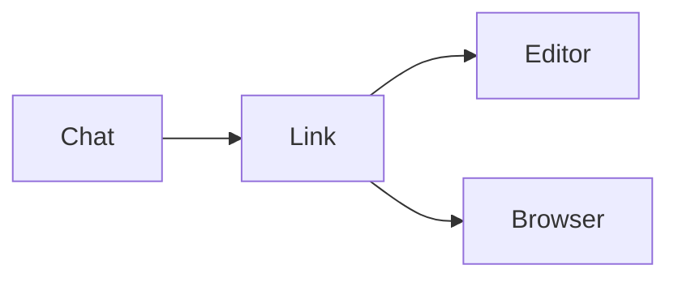

# Chat and editor formatting

Review **bold**, *italic*, ~~struck text~~ and `inline code`.

## Deployment

```sh
cd /var/www/example
npm ci
npm run build
```

> Review the files before deployment.

| Item | Status | Review |
| --- | --- | --- |
| Renderer | Updated | [MarkdownView.cs](../scylla-fluent/MarkdownView.cs) |
| Web link | External browser | [Example](https://example.com) |

- [Link routing](../scylla-fluent/MarkdownLink.cs:8)
- [Missing file](missing-file.md) should show a message, not open a browser.

---


