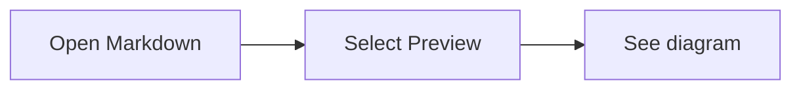

# Mermaid preview smoke test

Open this file in Scylla and select **Preview**. The first two blocks should
render as diagrams between the surrounding Markdown paragraphs.



Tilde fences should work too:

~~~mermaid
sequenceDiagram
    User->>Scylla: Preview file
    Scylla-->>User: Render diagram offline
~~~

This example should stay code, without creating another diagram:

````text

````

An invalid diagram should show an error and its original source:

```mermaid
this is not a diagram
```

Switch between Source and Preview, resize the pane, and switch file tabs.
The source should remain unchanged and the diagrams should render again.
